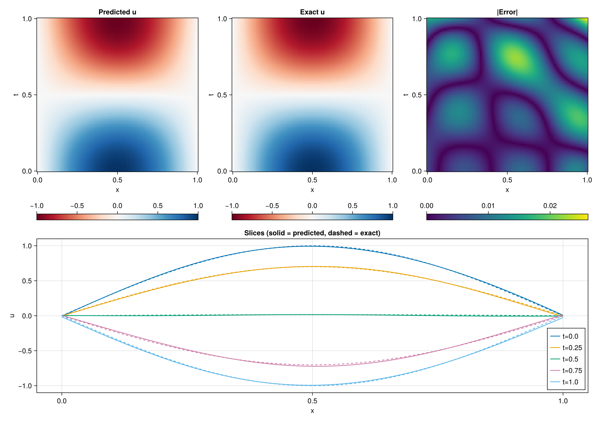
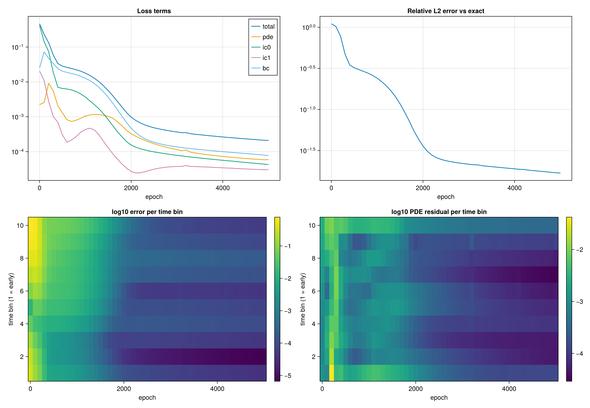

# Project 04 — 1D Wave Equation

Part of the SciML Foundations series — a structured sequence of scientific machine learning projects built entirely from scratch in Julia.

**Series:** Phase 1 Foundations (Projects 1–7)
1. PINN — Harmonic Oscillator
2. NODE — Lotka-Volterra Neural ODE
3. DeepONet — Anti-derivative Operator
4. PINN — 1D Wave Equation ← you are here
5. FNO — 1D Burgers Equation
6. GNN — Spring-Mass System
7. DeepONet — ODE Solution Operator

---

## The Problem

The 1D wave equation describes small transverse vibrations of a taut string, and the same mathematics governs sound in a tube and signals on a transmission line. The governing equation is:

$$\frac{\partial^2 u}{\partial t^2} = c^2 \frac{\partial^2 u}{\partial x^2}, \quad (x,t) \in [0,1]^2$$

with initial conditions $u(x,0) = \sin(\pi x)$, $u_t(x,0) = 0$, fixed ends $u(0,t) = u(1,t) = 0$, and analytical solution $u(x,t) = \sin(\pi x)\cos(\pi c t)$.

This is the first PDE in the series. Compared with the harmonic oscillator there are now two independent variables, a second derivative in each, and a new failure mode: the loss treats all times equally, so the network can fit late times before it has learned the initial condition. This project builds a PINN for it from scratch and tests a causal training fix against an unweighted baseline.

---

## Repository Structure

```
p04_wave_equation/
├── hyperdual.jl     — HyperDual number type and arithmetic (forward-mode, exact second derivatives)
├── network.jl       — MLP parameters, Xavier init, plain and hyperdual forward passes
├── sampling.jl      — Latin Hypercube Sampling, interior / IC / BC point generation
├── losses.jl        — Time binning and cumulative causal weights
├── autodiff.jl      — Second-order forward jet, unified backward pass, full gradient assembly
├── optimizer.jl     — Adam
├── evaluate.jl      — Analytical solution, error metrics, per-time-bin diagnostics, plots
├── train.jl         — Training loop, logging, checkpoints (entry point)
└── gradcheck.jl     — Finite-difference verification of every differentiation component
```

---

## The Physics-Informed Approach

The network $\hat{u}_\theta(x,t)$ is an MLP with architecture `[2, 20, 20, 20, 1]`: the pair $(x,t)$ in, displacement out, tanh on the hidden layers and a linear output layer. Weights use Xavier uniform initialization so tanh does not saturate at the start. Tanh is required because the loss contains second derivatives of the network, and an activation with zero second derivative (ReLU) would make the PDE term vanish.

There are two separate differentiation problems in a PINN:

| Problem | What | Mechanism |
|---------|------|-----------|
| Physics derivatives | $u_{tt}$, $u_{xx}$ — derivatives of the output with respect to its inputs $(x,t)$ | Forward mode: hyperdual numbers |
| Training derivatives | $\partial \mathcal{L}/\partial\theta$ — derivatives of the loss with respect to every weight | Reverse mode: manual backprop |

Forward mode suits the first because there are only two inputs. Reverse mode suits the second because there are thousands of parameters and one scalar loss.

---

## Forward Mode — Hyperdual Numbers

A hyperdual number carries four components:

$$a + b\,\varepsilon_1 + c\,\varepsilon_2 + d\,\varepsilon_1\varepsilon_2, \quad \varepsilon_1^2 = \varepsilon_2^2 = 0, \quad \varepsilon_1\varepsilon_2 \neq 0$$

Seeding both $\varepsilon_1$ and $\varepsilon_2$ along the same input variable makes the $\varepsilon_1\varepsilon_2$ coefficient of any smooth function exactly equal to its second derivative with respect to that variable, with no step size and no truncation error. Multiplication is the product rule:

$$(fg)_{12} = f\,g_{12} + f_1 g_2 + f_2 g_1 + f_{12}\,g$$

Passing through tanh applies the chain rule with the activation's own derivatives:

$$\tanh' = 1 - t^2, \quad \tanh'' = -2t(1-t^2), \quad d_{12}^{\text{out}} = \tanh'\,d_{12} + \tanh''\,d_1 d_2$$

One pass seeded on $x$ gives $u_{xx}$, one seeded on $t$ gives $u_{tt}$.

The hyperdual forward pass is kept as an independent reference implementation. Training uses an equivalent plain-vector formulation (the jet below) that is faster and can be reversed.

---

## Reverse Mode Through the Jet

Fixing a seed direction $s$, each layer carries a triple: value $h$, first derivative $\dot h = \partial h/\partial s$, and second derivative $\ddot h = \partial^2 h/\partial s^2$. A hidden layer maps the previous triple as:

$$z = W h_{\text{prev}} + b, \quad \dot z = W\dot h_{\text{prev}}, \quad \ddot z = W\ddot h_{\text{prev}}$$

$$h = \sigma(z), \quad \dot h = \sigma'(z)\odot\dot z, \quad \ddot h = \sigma'(z)\odot\ddot z + \sigma''(z)\odot\dot z^2$$

The output layer is linear. The derivative streams are coupled in one direction only, $h \to \dot h \to \ddot h$, so the backward pass flows $\ddot h \to \dot h \to h$.

Given adjoints $H_0, H_1, H_2$ arriving at a layer's output, the pre-activation adjoints are:

$$\bar z = H_0\sigma' + H_1\sigma''\dot z + H_2(\sigma''\ddot z + \sigma'''\dot z^2)$$
$$\bar{\dot z} = H_1\sigma' + 2H_2\sigma''\dot z, \qquad \bar{\ddot z} = H_2\sigma'$$

with parameter gradients

$$dW = \bar z\,h_{\text{prev}}^T + \bar{\dot z}\,\dot h_{\text{prev}}^T + \bar{\ddot z}\,\ddot h_{\text{prev}}^T, \quad db = \bar z$$

Training on a loss that contains $u_{ss}$ needs the third derivative of the activation, $\sigma''' = (1-\sigma^2)(6\sigma^2 - 2)$.

A single backward function takes three output adjoints $(g_0, g_1, g_2)$ on $(u, u_s, u_{ss})$. Every loss term is a different choice of seeds:

| Loss term | Pass | $g_0$ | $g_1$ | $g_2$ |
|-----------|------|-------|-------|-------|
| IC (shared pass) | seed $t$ | $2\lambda_{ic0}(u - \sin\pi x)/N_{ic}$ | $2\lambda_{ic1}\,u_t/N_{ic}$ | 0 |
| BC | seed $t$ | $2\lambda_{bc}\,u/N_{bc}$ | 0 | 0 |
| PDE, $t$-pass | seed $t$ | 0 | 0 | $\bar r_i$ |
| PDE, $x$-pass | seed $x$ | 0 | 0 | $-c^2\bar r_i$ |

where $\bar r_i = 2 w_i r_i / N_f$.

---

## The Loss Function

$$\mathcal{L} = \mathcal{L}_{pde} + \lambda_{ic0}\mathcal{L}_{ic0} + \lambda_{ic1}\mathcal{L}_{ic1} + \lambda_{bc}\mathcal{L}_{bc}$$

| Term | Meaning |
|------|---------|
| $`\mathcal{L}_{pde} = \frac{1}{N_f}\sum w_i\,(u_{tt} - c^2 u_{xx})_i^2`$ | Newton's law in the interior |
| $\mathcal{L}_{ic0} = \text{mean}\,[u(x,0) - \sin\pi x]^2$ | Initial shape |
| $\mathcal{L}_{ic1} = \text{mean}\,[u_t(x,0)]^2$ | Initial velocity (released from rest) |
| $\mathcal{L}_{bc} = \text{mean}\,[u(0,t)^2 + u(1,t)^2]$ | Clamped ends |

A second-order-in-time equation needs both initial conditions for a unique solution, and a second-order-in-space equation needs both boundary conditions, so none of the four terms is redundant.

---

## Causal Training

The plain PDE loss is an unordered average over all $(x,t)$, so nothing forces the network to get early times right first. Causal training bins the collocation points into $M$ ordered time windows, computes each bin's mean squared residual $\mathcal{L}_j$, and weights bin $i$ by

$$w_i = \exp\left(-\epsilon\sum_{j \lt i}\mathcal{L}_j\right)$$

A later bin only receives meaningful weight once every earlier bin already has a small residual. The weights are treated as constants in the backward pass (stop-gradient). The weights are recomputed every epoch from the current residuals, which makes this the one feedback loop in the system; $\epsilon$ is its gain. $\epsilon$ is annealed geometrically from $10^{-2}$ to $10^{1}$ over training, so the ordering constraint starts weak and tightens as the network learns.

---

## Sampling

Collocation points are drawn once with Latin Hypercube Sampling: each axis is divided into $N$ equal strata, the strata are randomly paired across axes, and each point is jittered within its cell. This guarantees every slice of $x$ and of $t$ contains exactly one point, which gives a lower-variance estimate of the PDE integral than plain uniform sampling.

| Set | Count | Location |
|-----|-------|----------|
| Interior $N_f$ | 2000 | LHS over $[0,1]^2$ |
| Initial $N_{ic}$ | 100 | $t = 0$, LHS in $x$ |
| Boundary $N_{bc}$ | 100 | $x = 0$ and $x = 1$, LHS in $t$ |

---

## The Adam Optimizer

Adam is implemented as in Project 1 with $\beta_1 = 0.9$, $\beta_2 = 0.999$, $\epsilon = 10^{-8}$, and moment buffers stored with the same layer structure as the parameters. The learning rate decays geometrically from $10^{-3}$ to $10^{-4}$ over training.

---

## Verification

Every differentiation component is checked independently before any training. Hand-derived values test the hyperdual arithmetic. The jet forward pass is compared with the hyperdual pass, and the backward pass is checked with central finite differences, one output adjoint at a time so a failure localizes to a specific term of the derivation.

| Check | Compares | Result |
|-------|----------|--------|
| Hyperdual arithmetic | Hand-derived $x^3$, $\tanh(x)$, $\tanh(2x+1)$, $x^2 t$ | Exact agreement |
| Forward agreement | Jet vs hyperdual vs plain forward | Max abs diff `3.3e-16` |
| Backward, $u$ | Backprop vs central differences | `~4e-9` |
| Backward, $u_s$ | Backprop vs central differences | `~1e-8` |
| Backward, $u_{ss}$ | Backprop vs central differences | `~2e-9` |
| Full pipeline ($c = 1$) | Assembled gradient vs finite differences | `~9e-10` |
| Full pipeline ($c = 3$, unequal $\lambda$) | Assembled gradient vs finite differences | `~3e-9` |

The last-layer bias gradient is exactly zero for $u_s$ and $u_{ss}$, as it must be, since the bias does not affect derivatives. The full-pipeline check runs with causal weights off, because finite differences would differentiate through the weights while the backward pass deliberately does not.

---

## Results

Two runs share the same seed, network, and collocation points: an unweighted baseline and cumulative causal training, 5000 epochs each at $c = 1$.

| Run | Final total loss | Final PDE loss | Final relative $L_2$ error | Wall time |
|-----|------------------|----------------|----------------------------|-----------|
| Baseline | `2.08e-4` | `5.75e-5` | `0.0167` | 1208 s |
| Causal | `2.10e-4` | `5.92e-5` | `0.0169` | 1268 s |

Both runs take the relative $L_2$ error from 1.10 at initialization to about 0.017 (1.7%).

**Baseline**


**Causal**




### Observations

- **No measurable difference at $c = 1$.** Final $L_2$ errors are 1.67% and 1.69%, and the loss curves and per-bin heatmaps are visually indistinguishable. This is a single seed, so a gap this small is within what a different seed could produce.
- **The baseline did not show a causality failure here.** At $c = 1$ the solution is half a period of $\cos(\pi t)$ over the domain, which is smooth enough that the unweighted loss fits all times together. Causal training has nothing to fix on this problem.
- **The causal weights were probably close to 1 throughout.** The weights are $\exp(-\epsilon\sum_{j<i}\mathcal{L}_j)$, and the per-bin residuals are small (about $10^{-3}$ early, $10^{-4}$ to $10^{-5}$ late) with $\epsilon$ reaching only 10. The exponent therefore stays near zero, so the weighting barely changes the loss. The minimum weight was not logged, so this is an inference from the loss magnitudes and not a measurement.
- **Error is concentrated at late times.** In both runs the final per-bin error is lowest in the early bins (about $10^{-5}$) and roughly an order of magnitude larger in the last bins. The largest pointwise error is about 0.025, near $(x \approx 0.55, t \approx 0.75)$ and in the $(x=1, t=1)$ corner, and the slices show a small boundary violation at late times.
- **Not fully converged at 5000 epochs.** The loss and $L_2$ curves are still decreasing slowly when training stops, and the learning rate has decayed to $10^{-4}$ by then.

### Next

The causality problem should appear at higher $c$, where $\cos(\pi c t)$ oscillates faster. The next experiment is $c \in \{2, 4\}$ for both runs, with the minimum causal weight logged each epoch and a larger final $\epsilon$, to test whether causal training helps once the baseline starts to struggle.

---

## Libraries

| Purpose | Library |
|---------|---------|
| Random sampling and seeding | `Random` (stdlib) |
| Statistics | `Statistics` (stdlib) |
| Log formatting | `Printf` (stdlib) |
| Checkpointing | `Serialization` (stdlib) |
| Visualization | `CairoMakie` |

The network, hyperdual numbers, second-order forward jet, backward pass, sampler, causal weighting, and Adam are all implemented from scratch.

---

## How to Run

```bash
julia train.jl
```

Trains the baseline and the causal run in sequence and writes `log.txt`, `params.jls`, `solution.png` and `training.png` to `results/<run name>/`. Plots refresh every 500 epochs, so progress can be checked mid-run.

To rerun the gradient checks, from the Julia REPL in the project folder:

```julia
include("train.jl")      # loads every source file; does not start training when included
include("gradcheck.jl")
run_checks_part1() && test_compute_gradients()
```
